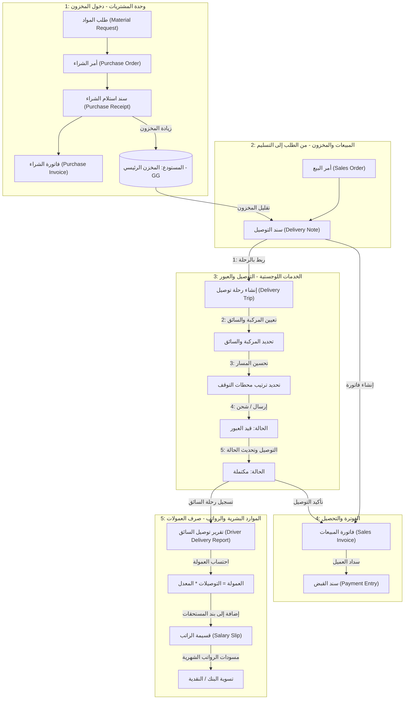
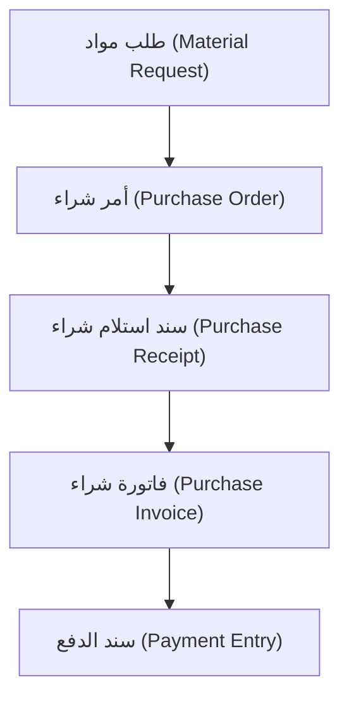
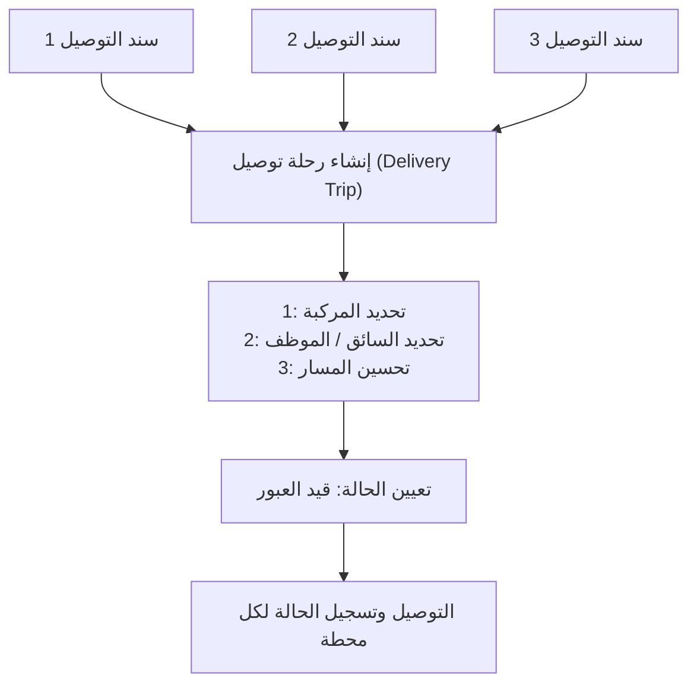

# 💧 جولدين جي إم للمياه (Golden-GM-Water) — إعداد نظام ERPNext ودورة العمل

توضح هذه الوثيقة إعدادات النظام ودورات العمل التشغيلية لشركة **جولدين جي إم للمياه (Golden-GM-Water)** في نظام ERPNext v16. نظرًا لأن العميل يتطلب تطبيقًا خفيفًا وبسيطًا دون وجود قاعدة كود برمجي مخصصة لتطبيق خلفي (باستثناء الحقول المخصصة والبرمجيات النصية المخصصة عبر واجهة المستخدم)، فإننا سنستخدم وحدات ERPNext القياسية للمخزون، المشتريات، المبيعات، والخدمات اللوجستية، مدمجة مع حقول مخصصة وإعدادات في **وحدة الموارد البشرية (HR)** لدعم عملياتهم.

---

## 🔄 مخطط دورة العمل التشغيلية المتكاملة (End-to-End)

يوضح مخطط التدفق أدناه كيفية تدفق البيانات، المخزون، وعمولات الرواتب عبر النظام بدءًا من شراء المخزون وحتى تسليم البضائع، وفوترة العملاء، ودفع عمولات السائقين:

---

## 🏗️ 1. إعداد البيانات الأساسية والمخزون

تقوم شركة جولدين جي إم للمياه ببيع زجاجات مياه الشرب. لإدارة المخزون والتتبع، اتبع الإعداد التالي:

### 📦 إعدادات بطاقة الصنف (Item Master)

نقوم بتعريف المنتج الأساسي وأي متغيرات للتعبئة والتغليف:

| رمز الصنف (Item Code) | اسم الصنف (Item Name) | مجموعة الصنف | مخزني / غير مخزني | وحدة القياس الافتراضية | التقييم | الوصف |
|---|---|---|---|---|---|---|
| `WATER-5G` | مياه شرب 5 جالون | بضائع جاهزة | مخزني | زجاجة (Btl) | FIFO | مياه شاملة الزجاجة |
| `EMPTY-BTL` | زجاجة فارغة 5 جالون | بضائع جاهزة | مخزني | زجاجة (Btl) | FIFO | هيكل الزجاجة الفارغ المخصص للمرتجعات/الودائع |

#### 🔄 دورة عمل إرجاع الزجاجات الفارغة والتأمين (اختياري)
إذا كانت الشركة تعمل بنظام برنامج تبادل الزجاجات:
1. **البيع للمرة الأولى**: إصدار فاتورة تحتوي على صنف `WATER-5G` وصنف `EMPTY-BTL` (رسوم تأمين للزجاجة الفارغة).
2. **عمليات التوصيل اللاحقة**: فوترة `WATER-5G` وقبول إرجاع `EMPTY-BTL`.
   - يتم التعامل مع هذا في نظام ERPNext من خلال **مرتجع مبيعات / إشعار دائن (Sales Return / Credit Note)** لصنف `EMPTY-BTL`، أو باستخدام **قيد المخزون (استلام مواد - Material Receipt)** لإعادة الزجاجات الفارغة إلى "مستودع الزجاجات الفارغة".

### 🏢 هيكل المستودعات (Warehouse Structure)
قم بإعداد مستودعين بسيطين لتتبع المخزون:
1. `Main Store - GG` (مستودع مخزني): لزجاجات المياه المعبأة الجاهزة للبيع.
2. `Empty Bottles - GG` (مستودع مخزني): للزجاجات الفارغة المرتجعة التي تنتظر إرسالها إلى المورد لإعادة تعبئتها.

---

## 🛒 2. دورة عمل المشتريات (مورد واحد)

تشتري المنشأة جميع مياه الشرب والزجاجات من مورد جملة واحد.

### خطوات العملية:
1. **أمر الشراء (Purchase Order)**: يتم مسودته عندما تنخفض مستويات المخزون في `المخزن الرئيسي - GG` عن حد إعادة الطلب.
2. **سند استلام الشراء (Purchase Receipt)**: يتم تسجيله عند وصول شاحنة التوصيل من مورد الجملة. يؤدي هذا الإجراء إلى زيادة المخزون في `المخزن الرئيسي - GG`.
3. **فاتورة الشراء (Purchase Invoice)**: يتم إنشاؤها من سند استلام الشراء لتعكس فاتورة المورد.
4. **سند الدفع (Payment Entry)**: يتم إنشاؤه عند تسوية الدفعة مع المورد (نقدًا أو عبر تحويل بنكي).

---

## 💼 3. دورة عمل المبيعات والشحن (عدة عملاء/منافذ بيع)

نقوم بالبيع للعديد من بائعي التجزئة والمكاتب والمنازل. تتم إدارة الشحن داخليًا بواسطة مركبات التوصيل والسائقين التابعين للشركة.

### 🖨️ تدفق عملية المبيعات
اعتمادًا على ما إذا كان البيع يتم بناءً على طلب مسبق أو بيعًا مباشرًا من الشاحنة:

#### الخيار أ: المبيعات المطلوبة مسبقًا (التسليمات المجدولة مسبقًا)
1. **أمر البيع (Sales Order)**: يقوم العميل بتقديم طلب.
2. **سند التوصيل (Delivery Note)**: يتم إنشاؤه عند تحميل سيارة التوصيل. يتم خصم المخزون من `المخزن الرئيسي - GG`.
3. **فاتورة المبيعات (Sales Invoice)**: يتم إنشاؤها من سند التوصيل بعد إتمام عملية التسليم للعميل بنجاح.
4. **سند القبض (Payment Entry)**: يتم تسجيله إذا قام العميل بالدفع عند الاستلام أو على الحساب (شروط ائتمانية).

#### الخيار ب: المبيعات المباشرة (البيع المباشر من الشاحنة / مبيعات فورية)
للسائقين الذين يبيعون مباشرة من المخزون المحمل في سيارات التوصيل الخاصة بهم:
1. **قيد المخزون (نقل مواد - Material Transfer)**: نقل عدد $N$ من الزجاجات من `المخزن الرئيسي - GG` إلى مستودع افتراضي يمثل شاحنة التوصيل (مثل `الشاحنة 1 - GG`).
2. **فاتورة المبيعات (Sales Invoice)**: يقوم السائق بإنشاء فاتورة مبيعات مباشرة مع تحديد مستودع المصدر كـ `الشاحنة 1 - GG`.
3. **نهاية اليوم**: تسوية الزجاجات المتبقية في `الشاحنة 1 - GG` وإعادتها إلى `المخزن الرئيسي - GG`.

---

## 🚚 4. إدارة الشحن ورحلات التوصيل

نظرًا لأن الشحن يتم داخليًا ("بواسطتنا")، يتم استخدام ميزة **رحلة التوصيل (Delivery Trip)** المدمجة في نظام ERPNext لتنظيم عمليات التسليم.

### خطوات الإعداد:
1. **سجل المركبات (Vehicle)**: تسجيل شاحنات/سيارات التوصيل في النظام.
2. **قواعد الشحن (Shipping Rules)**: إنشاء قاعدة شحن لرسوم التوصيل القياسية:
   - إضافة صف في جدول **ضرائب ورسوم المبيعات (Sales Taxes and Charges)** لرسوم الشحن/التوصيل.
3. **إنشاء رحلة التوصيل (Delivery Trip)**:
   - الانتقال إلى **رحلة التوصيل (Delivery Trip)** -> جديد.
   - تحديد **السائق** (المرتبط بسجل الموظف) و**المركبة**.
   - إضافة محطات التوقف عن طريق اختيار **سندات التوصيل (Delivery Notes)** المعلقة.
   - استخدام ميزة "حساب الوقت المتوقع للوصول (Calculate ETA)" أو تكامل الخرائط لتحديد تسلسل التوقفات.
   - عند الانتهاء، يتم وضع علامة على رحلة التوصيل كـ **مكتملة (Completed)**.

---

## 👥 5. إعدادات وتخصيصات وحدة الموارد البشرية (HR)

نظرًا لأن شركة جولدين جي إم للمياه تدار بواسطة عدد قليل من الموظفين الذين يتولون أدوارًا وظيفية مختلفة (المسؤول، المبيعات، المشتريات، المخزون، والتوصيل)، فإننا نرغب في الحفاظ على وحدة الموارد البشرية بسيطة وخفيفة ولكن مع تخصيصها لدعم التوزيع الداخلي.

### 🛠️ الحقول المخصصة لنوع مستند الموظف (Employee DocType)

لتتبع تفاصيل السائق ومعدلات العمولات مباشرة في ملف تعريف الموظف، قم بتهيئة الحقول المخصصة التالية عبر **الحقول المخصصة (Custom Field)** في نظام ERPNext:

| تسمية الحقل | اسم الحقل البرمجي | النوع | الخيارات / الجدول | الوصف |
|---|---|---|---|---|
| **تفاصيل السائق (مقطع)** | `driver_details_section` | فاصل مقطع (Section Break) | | تجميع معلومات السائق |
| **رقم رخصة القيادة** | `drivers_license_no` | بيانات (Data) | | رقم الرخصة لسائقي التوصيل |
| **تاريخ انتهاء الرخصة** | `license_expiry_date` | تاريخ (Date) | | لتتبع مواعيد تجديد الرخصة |
| **عمولة التوصيل (%)**| `delivery_commission_rate` | نسبة مئوية (Percent) | | العمولة المكتسبة لكل زجاجة/عملية توصيل |

---

### 💵 إعداد عمولات التوصيل وكشوف المرتبات (Payroll)

يتقاضى السائقون وموظفو التوصيل راتباً أساسياً بالإضافة إلى عمولة بناءً على عمليات التوصيل المكتملة.

#### الخطوة 1: إنشاء مكونات الدخل/الأرباح (Earning Components)
1. **الراتب الأساسي (Base Salary)**: مكون الراتب الشهري القياسي.
2. **عمولة التوصيل (Delivery Commission)**: مكون أرباح تم تكوينه كـ *مرن (Flexible)* (سيتم تعبئة المبالغ ديناميكيًا بناءً على تقارير التوصيل الشهرية).

#### الخطوة 2: تتبع التوصيلات الشهرية واحتساب العمولة
بما أن عدد الموظفين يتراوح بين 2 و3 فقط، فإن تتبع العمولات عملية بسيطة:
1. إنشاء **تقرير مخصص (Report)** أو **تقرير استعلام (Query Report)** في ERPNext باسم `تقرير توصيل السائق (Driver Delivery Report)`.
   - **عوامل التصفية (Filters)**: النطاق الزمني، السائق (الموظف).
   - **الأعمدة (Columns)**: معرف رحلة التوصيل (Delivery Trip ID)، المحطات المكتملة، إجمالي الزجاجات التي تم توصيلها، رسوم الشحن المحصلة.
2. احتساب العمولة الشهرية:
   - $\text{العمولة} = \text{إجمالي عمليات التوصيل} \times \text{معدل العمولة}$ (أو نسبة مئوية من رسوم الشحن).
3. **قسيمة الراتب (Salary Slip)**:
   - إنشاء `قسيمة راتب (Salary Slip)` شهرية للموظف.
   - إدخال مبلغ العمولة المحتسب يدويًا في صف **عمولة التوصيل (Delivery Commission)**.

---

### 📅 تسجيل حضور وإجازات مبسط

تجنب استخدام جداول المناوبات المعقدة. بدلاً من ذلك:
- **الحضور**:
  - تهيئة **أداة حضور الموظفين (Employee Attendance Tool)** لتمكين المسؤول (Admin) من تسجيل الحضور اليومي بنقرة واحدة (حاضر / غائب / نصف يوم).
- **إدارة الإجازات**:
  - تعريف نوعين أساسيين من الإجازات: `إجازة سنوية (Annual Leave)` و`إجازة مرضية (Sick Leave)`.
  - إجراء **توزيع إجازات (Leave Allocation)** لمرة واحدة في بداية العام.
  - يطلب الموظفون الإجازات شفهيًا أو عبر نموذج `طلب الإجازة (Leave Application)` القياسي، ويقوم المسؤول بالموافقة عليه.

---

## 🔒 6. أدوار وصلاحيات المستخدمين

تكوين صلاحيات مستخدمين بسيطة للأدوار الوظيفية الخمسة:

| اسم الدور | مستوى الوصول | الوحدات وأنواع المستندات المسموح بها |
|---|---|---|
| **المسؤول (Admin)** | وصول كامل (System Manager) | جميع الوحدات (الحسابات، المخزون، المبيعات، المشتريات، الموارد البشرية، الإعدادات) |
| **المبيعات (Sales)** | كتابة/قراءة تشغيلية | وحدة المبيعات (العميل، أمر البيع، فاتورة المبيعات، سند القبض) |
| **المشتريات (Purchase)** | كتابة/قراءة تشغيلية | وحدة المشتريات (المورد، طلب المواد، أمر الشراء، فاتورة الشراء) |
| **المخزون (Inventory)** | كتابة/قراءة لمراقبة المخزون | وحدة المخزون (الصنف، المستودع، قيد المخزون، سند التوصيل، سند استلام الشراء) |
| **التوصيل (Delivery)** | قراءة فقط عبر الهاتف المحمول / تحديث الحالة | عرض سندات التوصيل، وتحديث حالة رحلة التوصيل |
