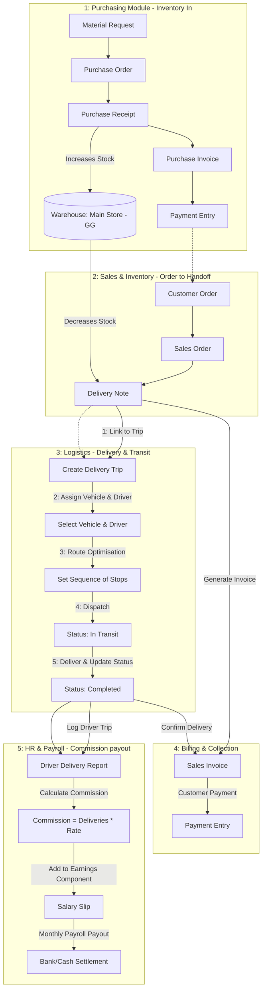
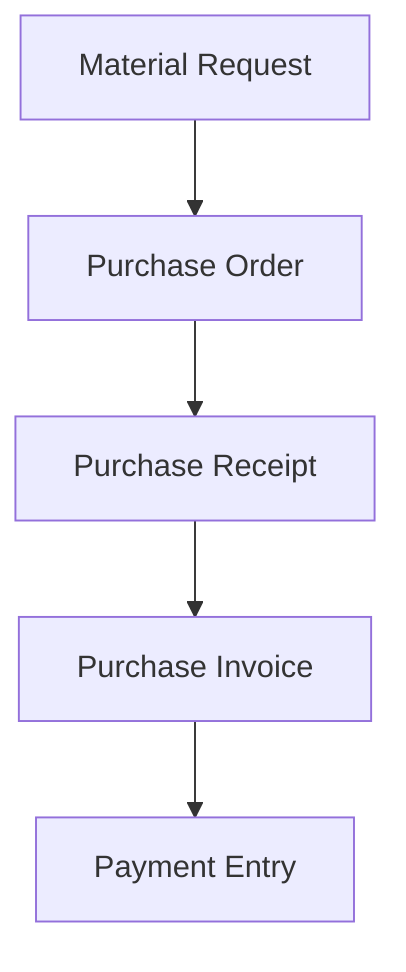
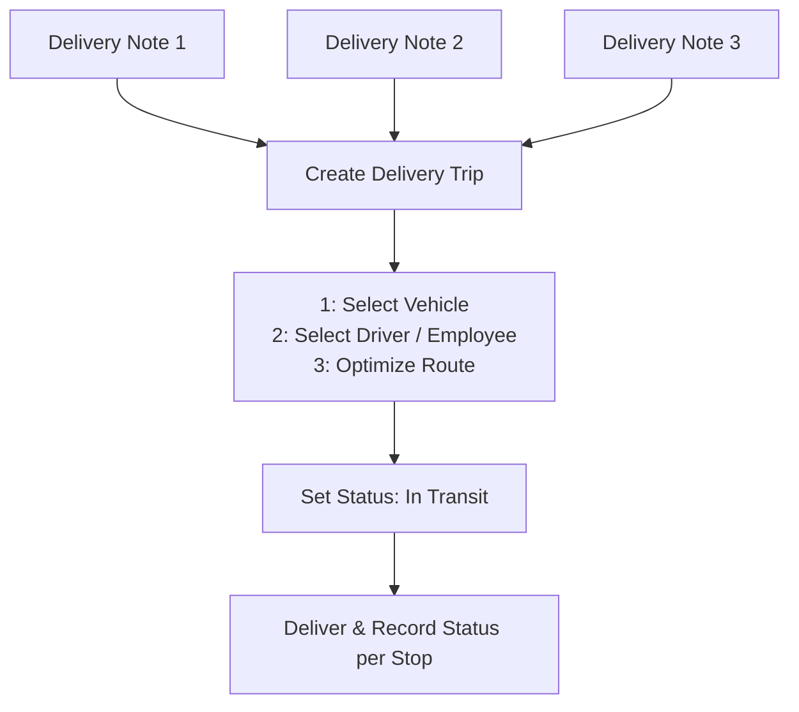

# 💧 Golden-GM-Water — ERPNext Setup and Workflow

This document outlines the system configuration and operational workflows for **Golden-GM-Water** in ERPNext v16. Since the client requires a lightweight implementation with no custom backend app codebase (except for custom fields/scripts configured via the UI), we will utilize standard ERPNext modules for Inventory, Purchasing, Sales, and Logistics, combined with custom fields and configurations in the **HR Module** for their 2-3 employees.

---

## 🔄 End-to-End Operational Workflow Diagram

The flowchart below illustrates how data, stock, and payroll commissions flow through the system from purchasing inventory to delivering goods, billing customers, and paying out driver commissions:

---

## 🏗️ 1. Core Data & Inventory Setup

Golden-GM-Water sells drinking water bottles. To manage stock and tracking, follow this setup:

### 📦 Item Master Configuration

We define the primary product and any packaging variants:

| Item Code | Item Name | Item Group | Stock/Non-Stock | Default UOM | Valuation | Description |
|---|---|---|---|---|---|---|
| `WATER-5G` | 5-Gallon Drinking Water | Finished Goods | Stock | Bottle (Btl) | FIFO | Water including the bottle |
| `EMPTY-BTL` | Empty 5-Gallon Bottle | Finished Goods | Stock | Bottle (Btl) | FIFO | Empty bottle shell for returns/deposits |

#### 🔄 Empty Bottle Return & Deposits Workflow (Optional)
If the company operates on a bottle exchange program:
1. **First-time Sale**: Invoice `WATER-5G` + `EMPTY-BTL` (deposit charge).
2. **Subsequent Deliveries**: Invoice `WATER-5G` and accept `EMPTY-BTL` back.
   - Handled in ERPNext via a **Sales Return / Credit Note** for `EMPTY-BTL`, or by using the **Stock Entry (Material Receipt)** to bring empty bottles back into the "Empty Bottles Warehouse".

### 🏢 Warehouse Structure
Setup two simple warehouses to track inventory:
1. `Main Store - GG` (Stock): For filled water bottles ready for sale.
2. `Empty Bottles - GG` (Stock): For returned empty bottles waiting to be sent to the supplier for refilling.

---

## 🛒 2. Purchasing Workflow (One Vendor)

The business buys all drinking water and bottles from a single wholesale vendor.

### Process Steps:
1. **Purchase Order (PO)**: Drafted when stock levels in `Main Store - GG` fall below the reorder point.
2. **Purchase Receipt (PR)**: Logged when the delivery truck arrives from the wholesale vendor. This increases inventory in `Main Store - GG`.
3. **Purchase Invoice (PI)**: Created from the Purchase Receipt to reflect the vendor's bill.
4. **Payment Entry**: Created when payment is settled with the supplier (Cash or Bank Transfer).

---

## 💼 3. Sales & Shipping Workflow (Multiple Vendors)

We sell to multiple retail vendors, offices, and homes. Shipping is managed internally by the company's own delivery vehicles and drivers.

### 🖨️ Sales Process Flow
Depending on whether the sale is pre-ordered or off-the-truck:

#### Option A: Pre-Ordered Sales (Deliveries scheduled in advance)
1. **Sales Order (SO)**: Customer places an order.
2. **Delivery Note (DN)**: Generated when the delivery van is loaded. Stock is deducted from `Main Store - GG`.
3. **Sales Invoice (SI)**: Generated from the Delivery Note after successful handoff.
4. **Payment Entry**: Recorded if the customer pays on delivery or on account (credit terms).

#### Option B: Direct Sales (Off-the-truck / Spot Sales)
For drivers who sell directly from stock loaded in their van:
1. **Stock Entry (Material Transfer)**: Transfer $N$ bottles from `Main Store - GG` to a virtual warehouse representing the delivery van (e.g., `Van 1 - GG`).
2. **Sales Invoice**: Driver creates a direct Sales Invoice selecting `Van 1 - GG` as the source warehouse.
3. **End of Day**: Reconcile remaining bottles in `Van 1 - GG` back to the `Main Store - GG`.

---

## 🚚 4. Shipping & Delivery Trip Management

Because shipping is handled in-house ("by us"), ERPNext's built-in **Delivery Trip** feature is used to organize deliveries.

### Configuration Steps:
1. **Vehicle Master**: Register the delivery vans/trucks.
2. **Shipping Rules**: Create a shipping rule for standard delivery charges:
   - Add a row in **Sales Taxes and Charges** for shipping/delivery fees.
3. **Delivery Trip creation**:
   - Go to **Delivery Trip** -> New.
   - Select the **Driver** (linked to the Employee record) and the **Vehicle**.
   - Add stops by selecting the pending **Delivery Notes**.
   - Use the "Calculate ETA" or map integration to sequence the stops.
   - Upon completion, mark the delivery trip as **Completed**.

---

## 👥 5. HR Module Configuration & Customizations

Since Golden-GM-Water is managed by **2-3 employees** (e.g., Driver/Delivery Agent, Sales/Admin Clerk, Operations Manager), we want to keep the HR module light but customized to support in-house distribution.

### 🛠️ Custom Fields for Employee DocType

To track driver details and commission rates directly on the Employee profile, configure the following custom fields via **Custom Field** in ERPNext:

| Field Label | Field Name | Type | Options / Table | Description |
|---|---|---|---|---|
| **Driver Details (Section)** | `driver_details_section` | Section Break | | Grouping for driver information |
| **Driver's License No** | `drivers_license_no` | Data | | License number for delivery drivers |
| **License Expiry Date** | `license_expiry_date` | Date | | To track renewal dates |
| **Delivery Commission (%)**| `delivery_commission_rate` | Percent | | Commission earned per bottle/delivery |

---

### 💵 Delivery Commission & Payroll Setup

Drivers and delivery staff are paid a base salary plus a commission based on deliveries completed.

#### Step 1: Create Earning Components
1. **Base Salary**: Standard monthly salary component.
2. **Delivery Commission**: Earning component configured as *Flexible* (amounts will be populated dynamically based on monthly delivery reports).

#### Step 2: Track Monthly Deliveries & Calculate Commission
Since there are only 2-3 employees, tracking commissions is simple:
1. Create a custom **Report** or **Query Report** in ERPNext called `Driver Delivery Report`.
   - **Filters**: Date Range, Driver (Employee).
   - **Columns**: Delivery Trip ID, Completed Stops, Total Bottles Delivered, Shipping Charge Collected.
2. Calculate the monthly commission:
   - $\text{Commission} = \text{Total Deliveries} \times \text{Commission Rate}$ (or a percentage of the shipping charges).
3. **Salary Slip**:
   - Create a monthly `Salary Slip` for the employee.
   - Manually enter the calculated commission amount into the **Delivery Commission** row.

---

### 📅 Simplified Attendance & Leave Logging

Avoid heavy shift rosters. Instead:
- **Attendance**:
  - Configure **Employee Attendance Tool** for single-click daily attendance marking (Present/Absent/Half Day) by the Admin Clerk.
- **Leave Management**:
  - Define 2 basic leave types: `Annual Leave` and `Sick Leave`.
  - Perform a one-time **Leave Allocation** at the start of the year.
  - Employees request leaves verbally or via the standard `Leave Application` form, which the Admin approves.

---

## 🔒 6. User Roles & Permissions

Configure simple user permissions for the 2-3 employees:

| Role Name | Access Level | Permitted Modules |
|---|---|---|
| **Water Admin / Owner** | Full Access (System Manager) | All modules (Accounts, Stock, Sales, Purchase, HR) |
| **Sales / Operations Clerk** | Operational Write/Read | Sales, Purchase, Stock, basic HR (Attendance, Expense Claims) |
| **Delivery Driver** | Mobile Read-Only / Desk user | View Delivery Notes, update Delivery Trip status |
