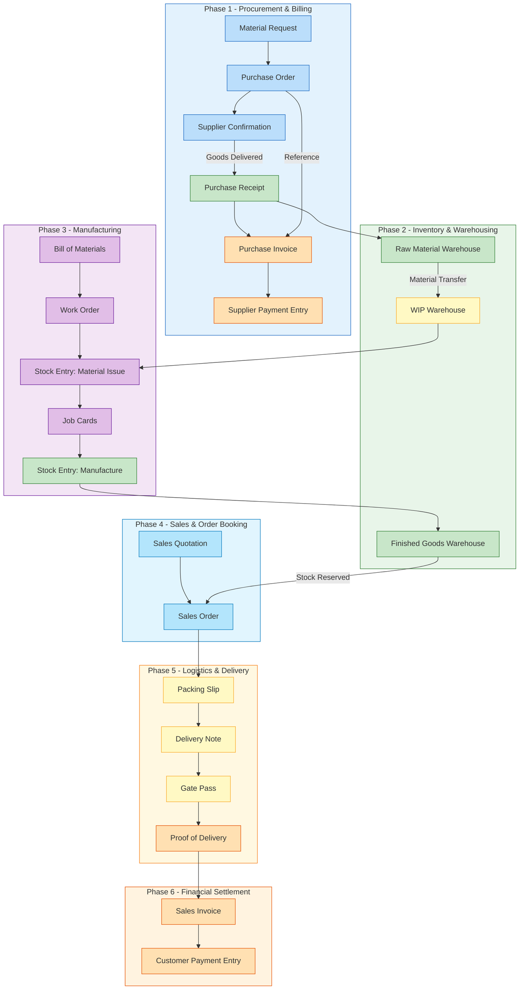
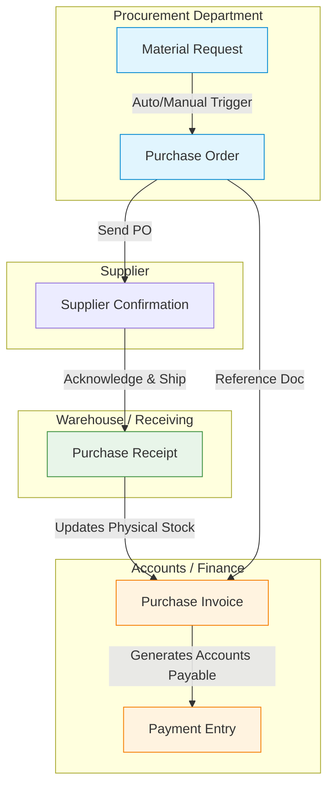
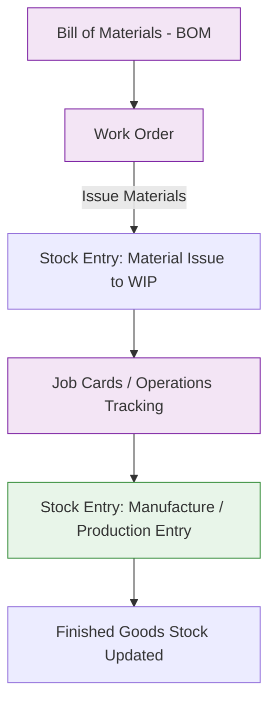
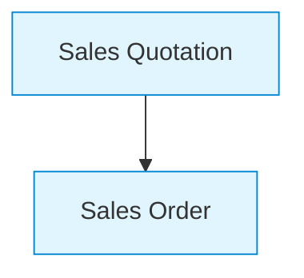
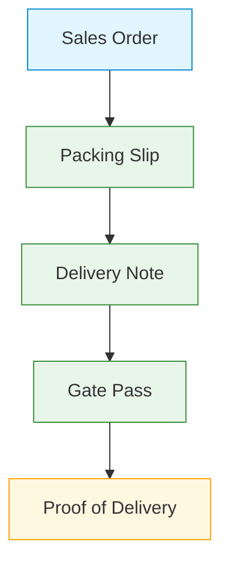
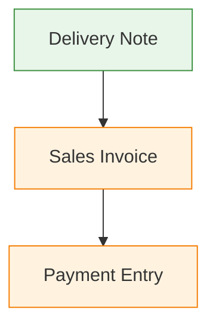

---
tags:
  - client/golden-gm
  - erpnext/workflow
  - process-map
---

This document outlines the complete operational workflow for **Golden GM** using **ERPNext**. It details the steps required to manage raw material procurement, inventory control, manufacturing (production), and sales/financial fulfillment.

## 📊 High-Level Process Overview

## Phase 1: Raw Material Procurement & Billing

This phase covers requesting raw materials, issuing purchase orders to suppliers, receiving goods into stock, and creating purchase invoices (billing).

### Detailed Steps:

1. **Material Request (MR):**
    
    - **User Role:** Warehouse Manager / Production Planner
        
    - **ERPNext DocType:** `Material Request` (Type: Purchase)
        
    - **Description:** Triggered when raw material stock levels fall below reorder thresholds or for a specific production run.
        
2. **Purchase Order (PO):**
    
    - **User Role:** Procurement Officer
        
    - **ERPNext DocType:** `Purchase Order`
        
    - **Description:** Generated from the Material Request and sent to the selected vendor/supplier with negotiated terms, unit prices, and expected delivery dates.
        
3. **Purchase Receipt (PR / GRN):**
    
    - **User Role:** Storekeeper / Warehouse Manager
        
    - **ERPNext DocType:** `Purchase Receipt`
        
    - **Description:** Logged when raw materials physically arrive. This updates the `Raw Material Warehouse` stock balance.
        
4. **Purchase Invoice (Bill Creation):**
    
    - **User Role:** Accounts Payable / Accountant
        
    - **ERPNext DocType:** `Purchase Invoice`
        
    - **Description:** The supplier's bill is recorded against the Purchase Receipt/Order. Creates an entry in Accounts Payable and logs tax/vendor balance.
        

## Phase 2: Inventory & Warehousing

Managing raw material storage, stock movements, and issuing goods to the production floor.

### Key Controls:

- **Batch & Serial Tracking:** Enable batch numbers for raw ingredients to maintain full traceability.
    
- **Warehouse Structure:**
    
    - `Stores / Raw Materials`
        
    - `Work In Progress (WIP) / Production Floor`
        
    - `Finished Goods Warehouse`
        

## Phase 3: Production / Manufacturing Workflow

This stage handles transforming raw materials into final packaged products (e.g., edible oil, consumer goods).

### Detailed Steps:

1. **Bill of Materials (BOM):**
    
    - Multi-level recipe defining all raw materials, packaging supplies, and operational costs required to yield a standard unit of finished product.
        
2. **Work Order:**
    
    - Initiates production for a specified quantity of finished goods. Auto-reserves required raw materials.
        
3. **Job Cards:**
    
    - Tracks operator tasks, workstation allocation, machine usage, and labor time spent during manufacturing.
        
4. **Stock Entry (Manufacture):**
    
    - Deducts raw materials from `WIP Warehouse` and increments finished product inventory in `Finished Goods Warehouse`. Calculates actual cost of production.
        

## Phase 4: Sales & Order Booking

Capturing customer orders and planning fulfillment.

### Detailed Steps:

1. **Sales Quotation:**
    
    - **User Role:** Sales Executive / Manager
    - **ERPNext DocType:** `Sales Quotation`
    - **Description:** Sent to prospective customers showing pricing and availability.
        
2. **Sales Order (SO):**
    
    - **User Role:** Sales Executive
    - **ERPNext DocType:** `Sales Order`
    - **Description:** Confirms customer agreement, items requested, delivery schedules, and payment terms. Auto-reserves finished goods stock if available.

## Phase 5: Logistics & Customer Delivery

Managing the physical packaging, dispatching, and transportation of products to the customer.

### Detailed Steps:

1. **Packing Slip:**
    
    - **User Role:** Warehouse Packer / Storekeeper
    - **ERPNext DocType:** `Packing Slip`
    - **Description:** Tracks individual packages, carton details, and specific quantities packed before shipment.
        
2. **Delivery Note (DN):**
    
    - **User Role:** Logistics Coordinator / Dispatch Officer
    - **ERPNext DocType:** `Delivery Note`
    - **Description:** Decrements stock from `Finished Goods Warehouse` upon shipment. Acts as the official dispatch document.
        
3. **Gate Pass:**
    
    - **User Role:** Security / Gatekeeper
    - **ERPNext DocType:** `Gate Pass` (Type: Outward)
    - **Description:** Authorizes transport vehicle loading and exit from factory/warehouse premises.
        
4. **Proof of Delivery (POD):**
    
    - **User Role:** Delivery Driver / Logistics Team
    - **ERPNext DocType:** `Delivery Note` (Attach signed POD receipt)
    - **Description:** Scanned copy of the physical receipt signed by the customer upon delivery, attached to the Delivery Note in ERPNext.

## Phase 6: Financial Settlement (Billing & Payment)

Generating invoicing and recording payments from customers.

### Detailed Steps:

1. **Sales Invoice (SI):**
    
    - **User Role:** Accounts Receivable / Accountant
    - **ERPNext DocType:** `Sales Invoice`
    - **Description:** Generates the financial invoice, updates Accounts Receivable, and records Cost of Goods Sold (COGS).
        
2. **Payment Entry (PE):**
    
    - **User Role:** Cashier / Finance Accountant
    - **ERPNext DocType:** `Payment Entry`
    - **Description:** Logs incoming customer payment via bank transfer, cash, check, or credit.

## 🛠 Summary Table of ERPNext Document Mapping

|Stage|Process Step|Primary ERPNext DocType|Primary User / Role|
|---|---|---|---|
|**Procurement**|Material Request|`Material Request`|Warehouse Manager / Production Planner|
|**Procurement**|Purchase Order|`Purchase Order`|Procurement Manager|
|**Procurement**|Goods Receipt|`Purchase Receipt`|Storekeeper|
|**Billing**|Supplier Invoicing|`Purchase Invoice`|Accounts Payable|
|**Inventory**|Stock Issue / Transfer|`Stock Entry`|Warehouse User|
|**Manufacturing**|Product Recipe|`BOM`|Production Head|
|**Manufacturing**|Production Order|`Work Order`|Production Supervisor|
|**Sales**|Customer Order|`Sales Order`|Sales Executive|
|**Logistics**|Packing details|`Packing Slip`|Warehouse Packer|
|**Logistics**|Shipping/Dispatch|`Delivery Note`|Logistics Coordinator / Dispatch Officer|
|**Logistics**|Vehicle Exit|`Gate Pass`|Gatekeeper|
|**Finance**|Customer Invoicing|`Sales Invoice`|Accounts Receivable|
|**Finance**|Payment Settlement|`Payment Entry`|Accountant|

_Created for Golden GM ERPNext Implementation._